University: [ITMO University](https://itmo.ru/ru/) 
Faculty: [FICT](https://fict.itmo.ru) 
Course: [Introduction in routing](https://github.com/itmo-ict-faculty/introduction-in-routing) 
Year: 2025/2026 
Group: K3322 
Author: Feofanov Nikita 
Lab: Lab3 
Date of create: 25.11.2025 
Date of finished: 25.11.2025 

# Задание

Вам необходимо сделать IP/MPLS сеть связи для "RogaIKopita Games" изображенную на рисунке 1 в ContainerLab. Необходимо создать все устройства указанные на схеме и соединения между ними.

- Помимо этого вам необходимо настроить IP адреса на интерфейсах.
- Настроить OSPF и MPLS.
- Настроить EoMPLS.
- Назначить адресацию на контейнеры, связанные между собой EoMPLS.
- Настроить имена устройств, сменить логины и пароли.

# Схема

Схема в draw.io:

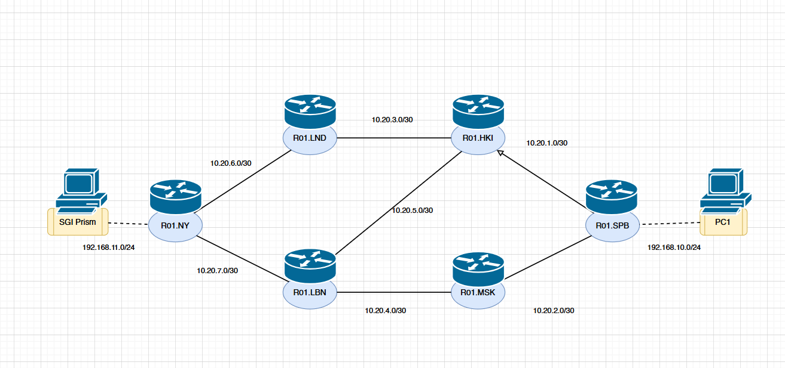

Схема ContainerLab:

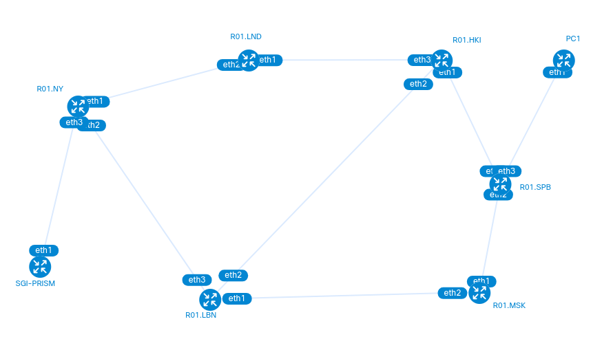

# yaml-конфиг

В конфигурации сети 6 роутеров, компьютер, а также SGI-PRISM использует образ компьютера.

Сеть управления: 172.16.16.0/24.

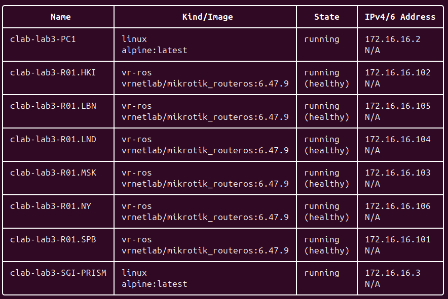

# Конфиги устройств

## Роутеры

1) Прописываем интерфейсы на портах по нарисованной схеме, а в роутерах NY и SPB ещё и dhcp-сервера.
2) Настраиваем динамическую маршрутизацию osfp:
- /interface bridge add name=loopback (loopback хорош тем, что это интерфейс с IP-адресом, который сам по себе никогда не упадёт без вмешательства)
- /ip address interface=loopback
- /routing ospf instance (указываем в router-id адрес loopback интерфейса)
- /routing ospf area (достаточно одной зоны для всех устройств)
- /routing ospf network (пишем имя зоны и все физические подключения)
3) Настройка MPLS:
- /mpls ldp (для transport-address тоже удобно использовать адрес loopback)
- /mpls ldp advertise-filter & accept-filter (Ограничиваем, какие префиксы сетей будут получать ярлыки)
/mpls ldp interface (просто указываем все интерфейсы роутеров)
4) Настраиваем EoMPLS (на NY и SPB роутерах)
- /interface bridge (VPN, который соединяем с интерфейсом vpls и портом)
- /interface vpls (remote-peer: ip loopback-интерфейса другого роутера)
- /interface bridge port

## Компьютеры

Аналогично предыдущим лабораторным запрашивают ip у dhcp-сервера.

# Результаты

## 1: OSPF

Проверка динамической маршрутизации:

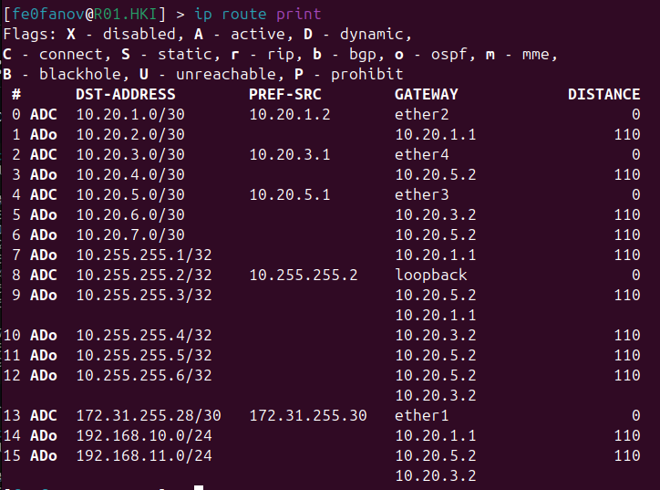
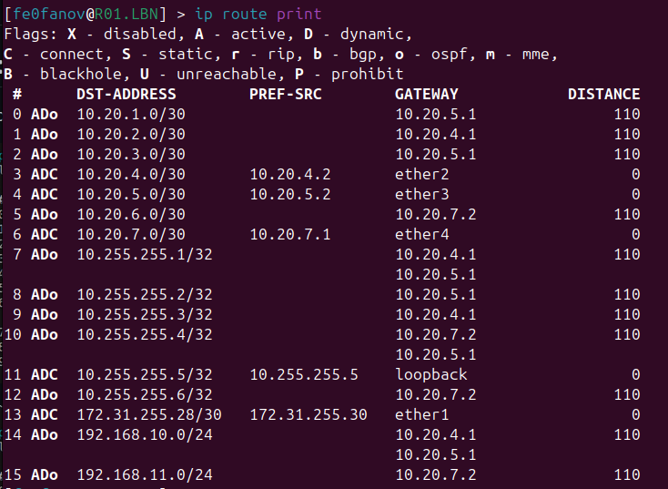
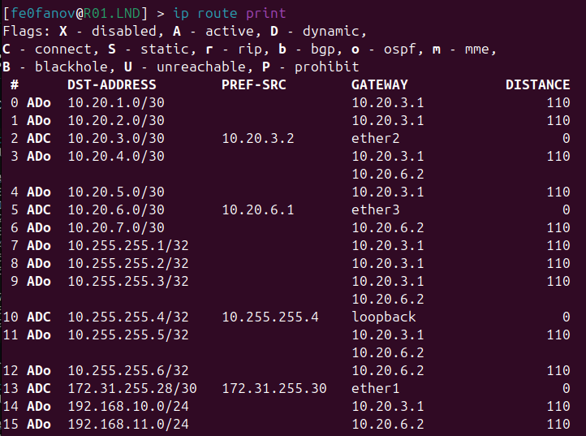
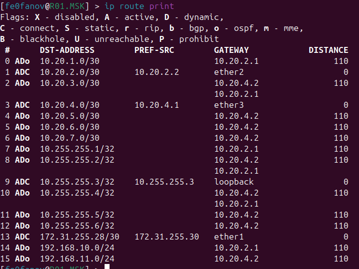
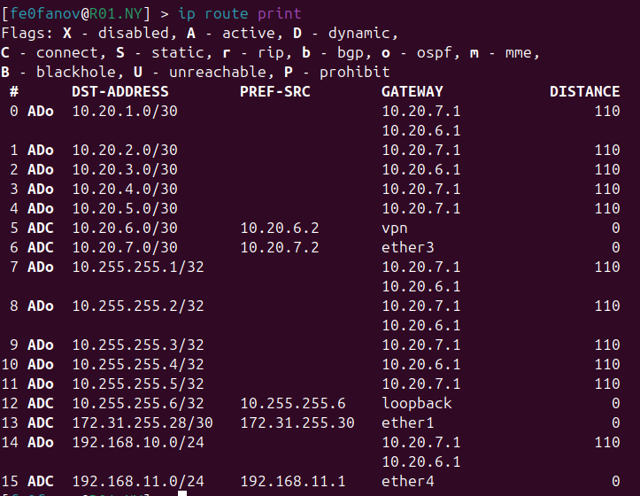
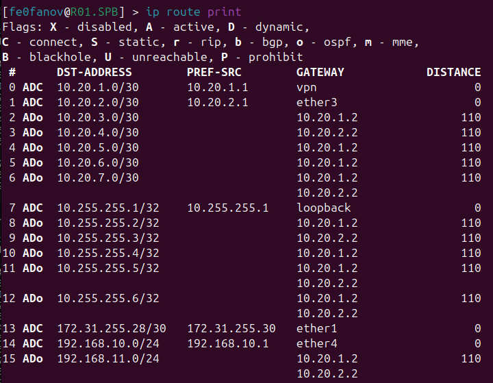

Видно, что всё настроено динамически.

## 2: MPLS

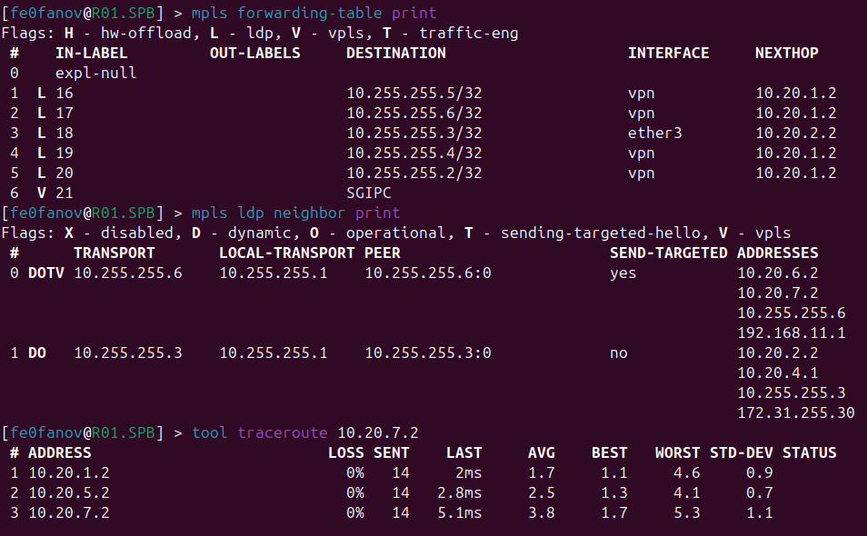
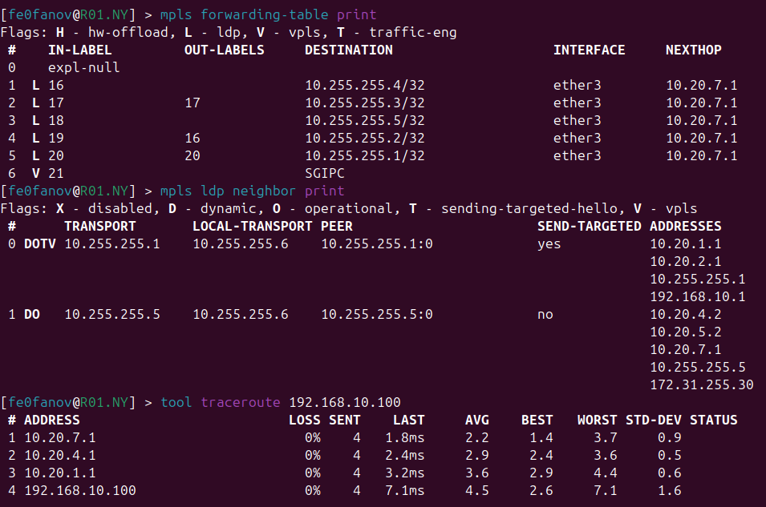
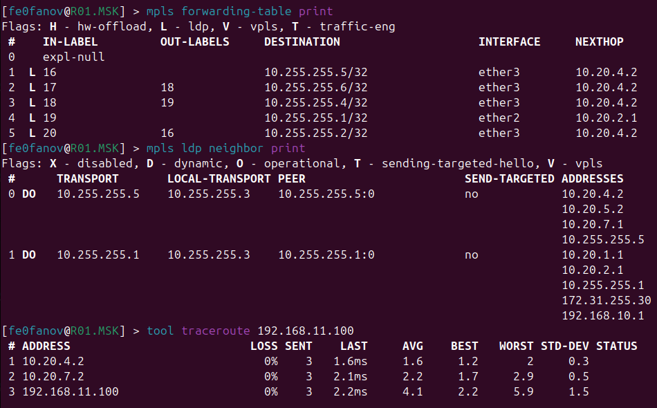
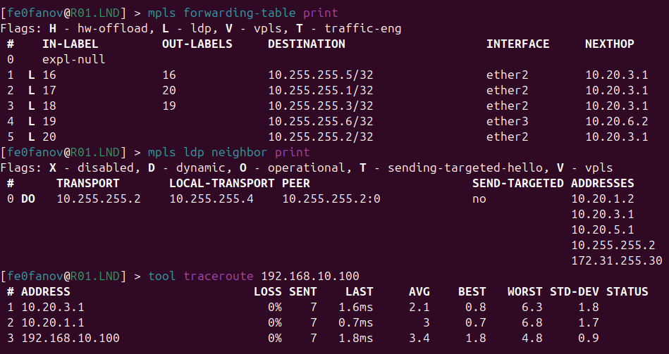
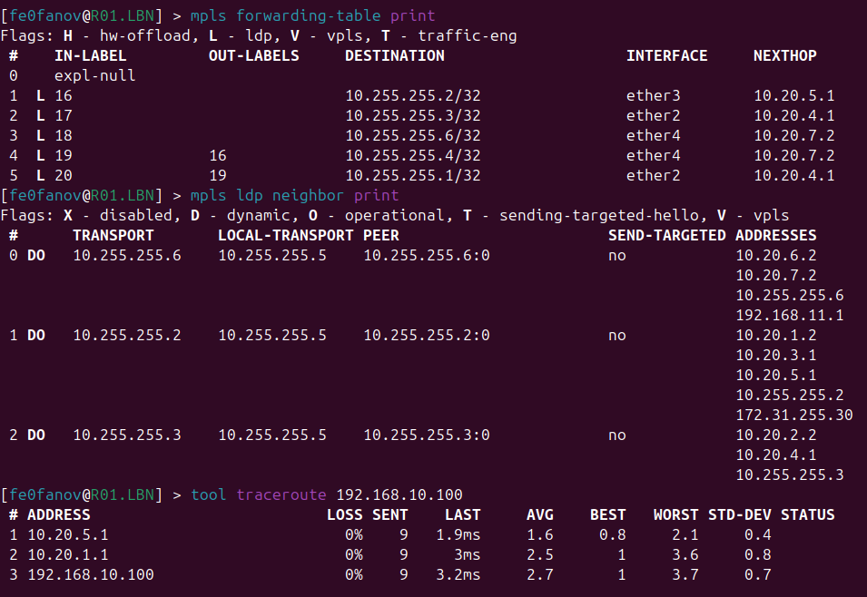
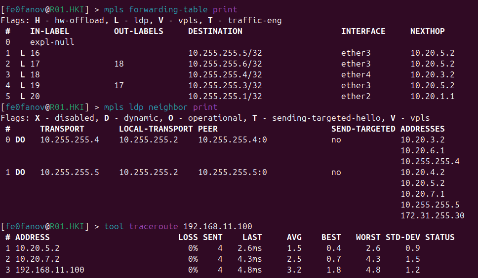

С фильтрацией:

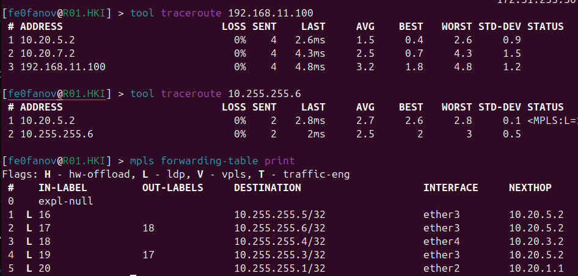

## 3: VPLS

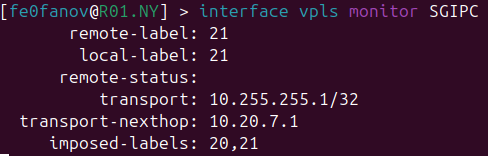
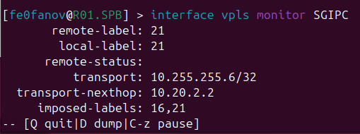

## Соединение компьютеров

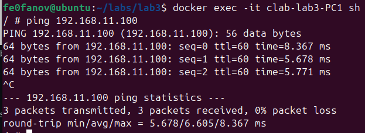

# Заключение

Была настроена динамическая маршрутизация через OSFP, поверх которой положена сеть MPLS, и был проведён туннель VPLS между роутерами NY и SPB.

Лабораторная работа успешно выполнена!
