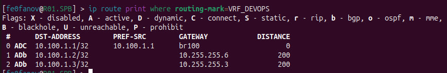
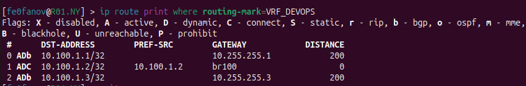
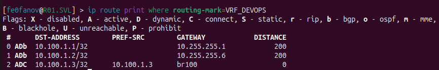

University: [ITMO University](https://itmo.ru/ru/) 
Faculty: [FICT](https://fict.itmo.ru) 
Course: [Introduction in routing](https://github.com/itmo-ict-faculty/introduction-in-routing) 
Year: 2025/2026 
Group: K3322 
Author: Feofanov Nikita 
Lab: Lab3 
Date of create: 25.11.2025 
Date of finished: 25.11.2025 

# Задание

Вам необходимо сделать IP/MPLS сеть связи для "RogaIKopita Games". Необходимо создать все устройства указанные на схеме и соединения между ними.

- Помимо этого вам необходимо настроить IP адреса на интерфейсах.
- Настроить OSPF и MPLS.
- Настроить iBGP с route reflector кластером

И вот тут лабораторная работа работа разделяется на 2 части, в первой части вам надо настроить L3VPN, во второй настроить VPLS, но при этом менять топологию не требуется. Вы можете просто разобрать VRF и на их месте собрать VPLS.

Первая часть:
- Настроить iBGP RR Cluster.
- Настроить VRF на 3 роутерах.
- Настроить RD и RT на 3 роутерах.
- Настроить IP адреса в VRF.
- Проверить связность между VRF
- Настроить имена устройств, сменить логины и пароли.

Вторая часть:
- Разобрать VRF на 3 роутерах (или отвязать их от интерфейсов).
- Настроить VPLS на 3 роутерах.
- Настроить IP адресацию на PC1,2,3 в одной сети.
- Проверить связность.

# Схема

Схема draw.io:

Схема ContainerLab:

# yaml-конфиг

Конфигурация сети аналогична предыдущей лабораторной работе: 6 роутеров и 3 компьютера. Сеть управления: 172.16.16.0/24.

# Конфиги устройств

## Роутеры

### OSPF и MPLS

Настройку OSPF и MPLS взял из предыдущей работы, немного изменив в соответствии с новой схемой.

### iBGP c Route Reflector
 
1. Выбор AS Number

Autonomous System — это система сетей под управлением единственной административной зоны. Так как у нас зона одна, выбрал 1 (64512-65534) число, для красоты - 65000.

2. Настройка iBGP

В конфигах мы будем указывать номер зоны конфигурируемого роутера как 65000, у соседей тоже будет номер зоны 65000.

- `/routing bgp instance` (set default, номер AS и id роутера. id такой же, что и у loopback)
- `/routing bgp peer` (remote-address, remote-as, route-reflect, address-families=l2vpn, vpnv4, привязываем к loopback)
- `/routing bgp network` (сеть loopback)

3. Настраиваем vrf на внешних роутерах

- /interface bridge (привязываем рут vrf и свой адрес к мосту); 
- /ip address (адрес для моста)
- /ip route vrf (export-route-targets, import-route-targets, route-distinguisher с тем же ASN, routing-mark)
- /routing bgp instance vrf (redistribute-connected=yes и аналогичный routing-mark)

4. Настройка VPLS (2 часть)

В /mpls ldp interface нужно указать интерфейс, направленный на компьютер.

На всех 3-ёх внешних роутерах настраиваем:

- /interface bridge (имя)
- /interface bridge port (к порту, направленный на компьютер)
- /interface vpls bgp-vpls (тоже руты как и у /ip route vrf, а вместо routing-mark - site-id с уникальным айди для каждого роутера)
- /ip address (привязка к мосту)

Чтобы задать ip компьютерам в одной сети VPN, нужно на одном из роутеров поставить dhcp-сервер. Патриотично поставлю его в СПБ.

Убираем раздачу dhcp-адресов с роутеров из 1-й части, на SPB создаём новый пул из сети впн и подключаем его к нему.

## Компьютеры

Аналогично предыдущим лабораторным компьютеры запрашивают ip у dhcp-сервера, а во 2-й части с сервера на SPB роутере.

# Результаты

## 1: OSPF

Проверка динамическую маршрутизации:

## 2: MPLS

## 3: iBGP

Можно заметить флаг E - established. Значит все конфиги настроены без ошибок.

## 4: VRF

Маршруты на внешних роутерах:

Пинги между роутерами:

## 2-я часть: VPLS

Раздача IP-адресов через DHCP сервер на роутере СПБ:

Пинги между компьютерами:

# Заключение

Была создана IP/MPLS сеть. На ней были настроены протоколы OSPF, MPLS и iBGP с Route Reflector-кластером. В 1-й части был настроен L3VPN, VRF, во 2-й части был настроен VPLS.

Лабораторная работа успешно выполнена!